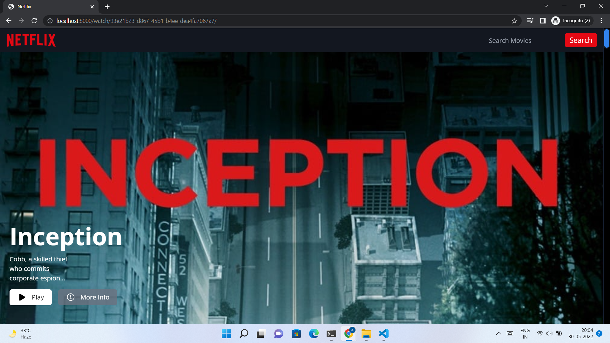

<div id="top"></div>

<div align="center">

  <h1 align="center">Movie Recommendation Site</h1>

  <p align="center">
    An awesome movie recommendation site made using Django.
    <br />
  </p>
</div>


<!-- TABLE OF CONTENTS -->
<details>
  <summary>Table of Contents</summary>
  <ol>
    <li>
      <a href="#about-the-project">About The Project</a>
      <ul>
        <li><a href="#built-with">Built With</a></li>
      </ul>
    </li>
    <li>
      <a href="#getting-started">Getting Started</a>
      <ul>
        <li><a href="#prerequisites">Prerequisites</a></li>
        <li><a href="#installation">Installation</a></li>
      </ul>
    </li>
    <li>
      <a href="#usage">Usage</a>
      <ul>
        <li><a href="#index">Index</a></li>
        <li><a href="#sign-up">Sign up</a></li>
        <li><a href="#sign-in">Sign in</a></li>
        <li><a href="#profile-page">Profile page</a></li>
        <li><a href="#add-new-profile">Add new Profile</a></li>
        <li><a href="#main-page">Main page</a></li>
        <li><a href="#genre">Genre</a></li>
        <li><a href="#movie-details">Movie details</a></li>
        <li><a href="#rating-a-movie">Rating a movie</a></li>
        <li><a href="#adding-a-movie-to-my-list">Adding a movie to My List</a></li>
        <li><a href="#recommendations">Recommendations</a></li>
        <li><a href="#search">Search</a></li>
        <li><a href="#upload-csv">Upload CSV</a></li>
      </ul>
    </li>
    <li><a href="#roadmap">Roadmap</a></li>
    <li><a href="#license">License</a></li>
    <li><a href="#creator">Creator</a></li>
  </ol>
</details>


<!-- ABOUT THE PROJECT -->
## About The Project

This project was developed for the `Engage 2022` program  for engineering students across India graduating in 2024.  
The topic I chose was to develop a recommendation engine by using the knowledge of algorithms.  

The major highlights of the projects are

* Login for existing users and Signup for new users.
* Recommending movies by filtering the adult content for kids users.
* Recommending movies by genre, directors, popularity, vote average ...
* Users can search for a movie.
* Users are able to add/remove movies to their list.
* Users are able to give ratings to a particular movie from which, they would be recommended movies based on the ratings of other users (`Collaborative filtering`)
* Admin can add a csv file to the movies dataset instead of adding each movie manually.

Of course, no recommenation system is always accurate, so I have recommended movies by various parameters and also I plan to include more parameters in future developements.  

## Some credentials
* User
    - Username: `user`
    - Email: `user@movierecommender.com`
    - Password: `userpass`

* Admin
    - Username: `admin`
    - Email: `admin@movierecommender.com`
    - Password: `adminpass`

<p align="right">(<a href="#top">back to top</a>)</p>


### Built With

The web app is made with

* [Django](https://www.djangoproject.com/)
* [Bootstrap](https://getbootstrap.com)
* HTML, CSS, JS

Django was preffered for the developement of the project due to the following reasons

* As, Django uses MVT architecture, so it offers rapid-developement.  
* Built in database support.

<p align="right">(<a href="#top">back to top</a>)</p>


<!-- GETTING STARTED -->
## Getting Started

This is an example of how you may give instructions on setting up your project locally.
To get a local copy up and running follow these simple example steps.

### Prerequisites

For running the application on your local machine first clone the project repo using
* git clone
    ```sh
    git clone https://github.com/akashkb-a01/Movie-Recommendation-Site.git
    ```


### Installation

After cloning the repo to the machine, follow the follwing steps

Install the requirements for the project with
* pip 
    ```sh
    pip install -r requirements.txt
    ```

After installing the requirements, we are ready to run the website by entering the following command on the terminal
* python3
    ```
    python3 manage.py runserver
    ```

<p align="right">(<a href="#top">back to top</a>)</p>


<!-- USAGE EXAMPLES -->
## Usage

Once the website is live, we can go to any browser and access the site by the following url
```
localhost:8000
```

After signing up/logging in, we can explore the functionalities the project has to offer.

### Index 

Upon going to `localhost:8000` following page appears  


For signing in, a user may click on the `Sign in` button on the top right.  

For signing up, a user may click on the `Get Started` button or navigate to `Sign in` page and then click on  `Sign up`.  


### Sign up

For signing up, a user has to enter his email and password.  
`Note`: The password must be of atleast 8 characters.


<p align="right">(<a href="#top">back to top</a>)</p>

### Sign in

A registered user may login by validating his credentials as follws


### Profile page

Upon siging up/logging in, users are redirected to the profile page, wherein, they can select a profile or create a new one by clicking on the `Add a New Profile`  


### Add new Profile

Upon clicking on the `Add a new Profile`, users are supposed to fill the profile name and Maturity level of the profile (Kids/All), which is required to filter the adult content for the kid profile.


### Main page

Upon selecting/creating profile, user is redirected to the following main page.  
Here, movies are displayed by popularity, rating, genre and also movies are shown if there are any recommendations and also the movies that the user had added in their list.




### Genre

The genre shown in the `Main page` are clickable and once clicked, it redirects users to the page containing more movies (100 to be precise) of that genre.  
Following is the page, after clicking on `Adventure` in the `Main page`  


### Movie details

On clicking on any movie tile, users are redirected to the following page, wherein they are shown the following components

* Rate movie & Add to my list


* Details of the movie


* Other movies directed by the same director


* Other movies of the same genres


### Rating a movie

For rating (1-5) a movie, user simply needs to click on the number of stars and click the submit button.


### Adding a movie to My List  

For adding a movie, to `My List`, a user simply needs to check on the box and click on `Add` button.


The `Main page` now has this extra row of `My List`


On clicking on `My List`, the user is redirected to the `My List` page, wherein they can see all the movies added to their list.


Similar is the process to remove a movie from `My List`


### Recommendations

For getting recommendations, we rate some more movies so that the final data is something like  

* Inception - 4
* Deadpool - 4
* Minions - 5
* The Avengers - 3

Now, we create a new profile with Maturity level: Kids as follows


So, user is redirected to the page of the kind


Now, the user rates `Minons` a 4/5, then the `Main page` gets the additional row of recommendations


The reason `Deadpool` not being recommended to the user is because of it being a movie not suitable for `Kids`.  
Also the order in which movies are recommended is determined by the ratings of other users.  

The user may click on the `Recommendations`, to get more(>7) recommendations on the recommendations page.


### Search

The search works different for different pages

* Main page/My List/Recommended Movies
Here users can search any movie according to their `Maturity`.

* Movie details page
Here on searching a movie all movies are considered excluding the current movie.

* Genre page
Here only the movies of the same genre are considered, as the user has navigated to the genre page implying that s/he has interest in that particular genre.

### Upload CSV
This functionality is of great use to the `Admin` who needs to constantly update the database with the latest movies.  
The `Admin` login can be created using the command  
```sh
python3 manage.py createsuperuser
```

The `Admin` login page can be accessed at `localhost:8000/admin`


On logging in and navigating to `Movies` we see an option to `Upload a csv file`


On clicking on it, we are redirected to the page, where the file can be uploaded.  
A sample movie database `sample.csv` is provided in the repository.


<!-- ROADMAP -->
## Roadmap
This section is for the future developement plans

- [] Email verification and forgot password option for users
- [] Add additional parameters for recommending movies
    - [] Keywords
    - [] Cast and Crew


<p align="right">(<a href="#top">back to top</a>)</p>

<!-- LICENSE -->
## License

Distributed under the MIT License. See `LICENSE.txt` for more information.

<p align="right">(<a href="#top">back to top</a>)</p>


<!-- CONTACT -->
## Creator

Akash Biswas - akashkb.a01@gmail.com

Project Link: [https://github.com/akashkb-a01/Movie-Recommendation-Site](https://github.com/akashkb-a01/Movie-Recommendation-Site)

<p align="right">(<a href="#top">back to top</a>)</p>


